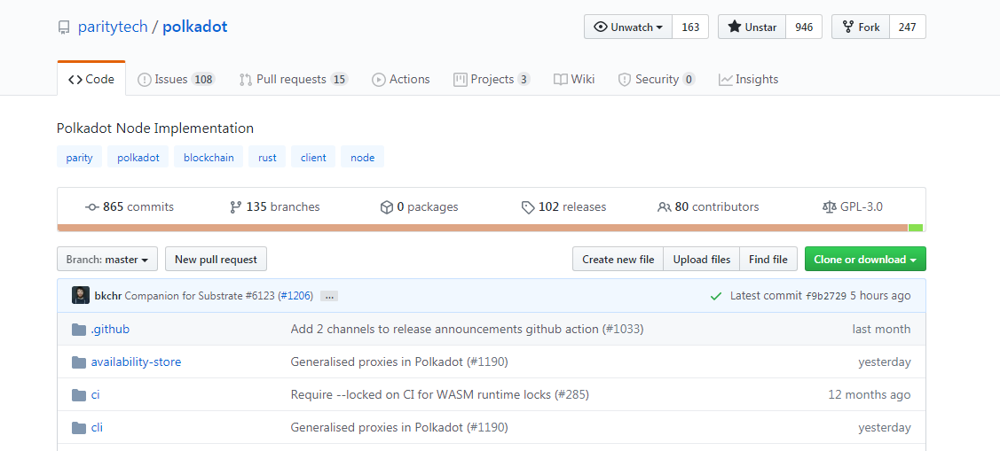
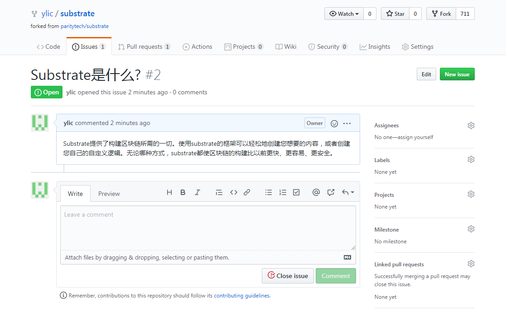
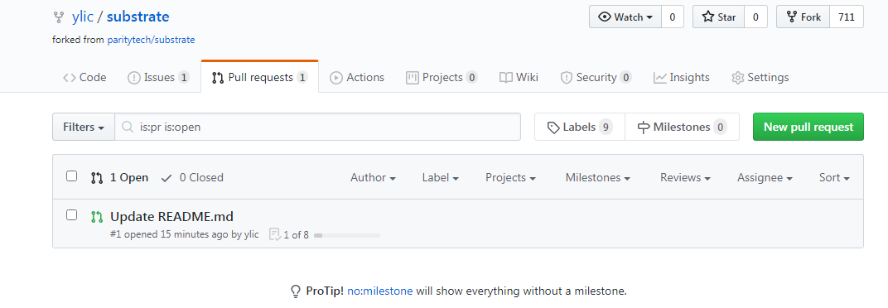
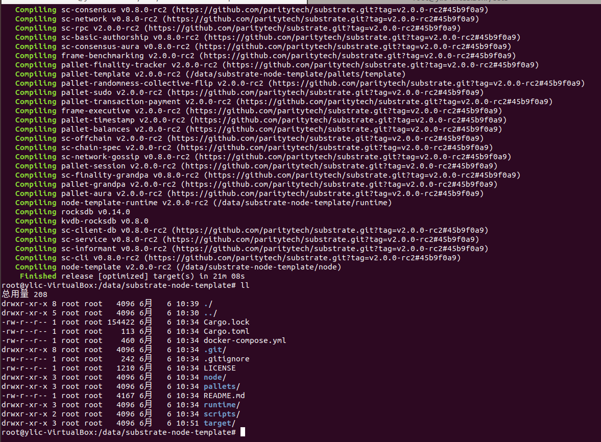
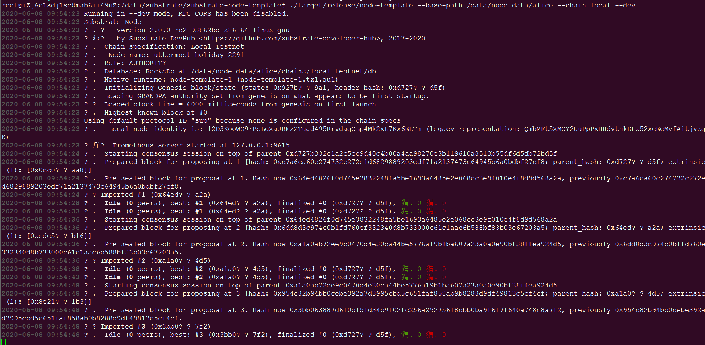
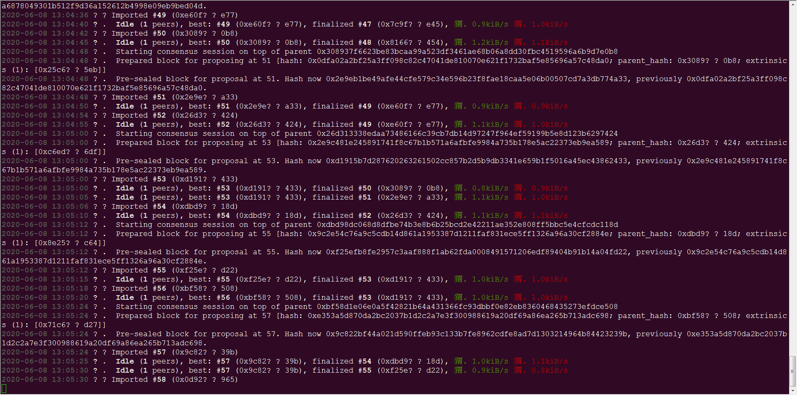
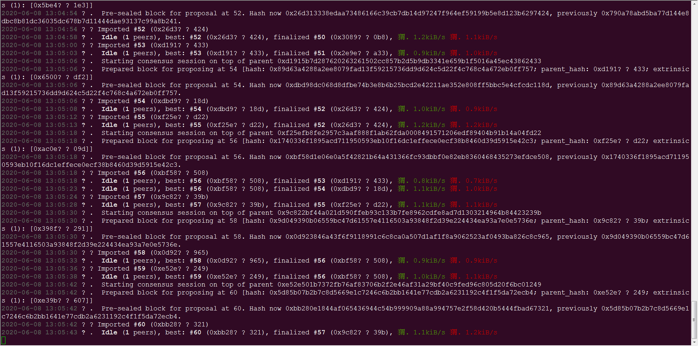
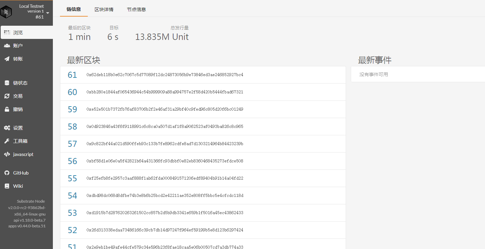

# 第一课作业答题卡

> 每一题的答案（文字/截图）请直接填写在问题下方。

#### 第一题

**请填写以下问题：（以下问题都可以在substrate官方文档里找到）**

- Substrate的官方文档网址是什么？

  1、Substrate官方主站 https://www.substrate.io 
  > 介绍Substrate是什么，Substrate能做什么，快速创建一个Substrate区块链。

  2、Substrate官方主站 https://www.substrate.dev 
  > 专注于Substrate开发方面的资讯，包含文档、Recipes、教程、社区等几个版块。
  
- Substrate的recipe网址是什么？
	https://substrate.dev/recipes/
  

- Substrate的rust docs的网址是什么？
	https://substrate.dev/rustdocs
  

- Substrate的tutorial的网址是什么？
	https://substrate.dev/zh-CN/tutorials
  

- Substrate Seminar在每周几进行？
	UTC时间  每周二14点
	北京时间 每周二晚上10点

#### 第二题

**github的基本操作，养成良好的开源社区开发习惯**

- star和watch substrate和polkadot的repo，并截屏
  
  

- fork substrate到自己的repo，并给自己的repo提一个issue和PR，并截屏
  

#### 第三题

**请编译第一节课中的node-template并截图编译成功的界面** (node-template链接： https://github.com/SubstrateCourse/substrate-node-template.git)

#### 第四题

**请运行node-template节点并截图 ，单节点和多节点分别截图（ (node-template链接： https://github.com/SubstrateCourse/substrate-node-template.git)）**

   
   
   
   