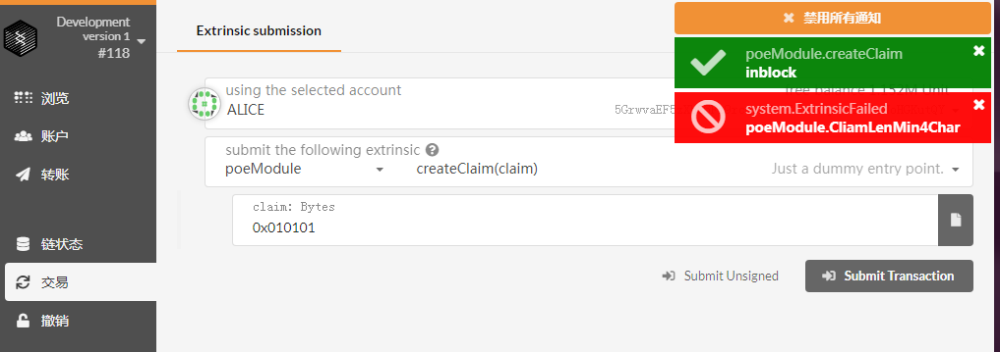
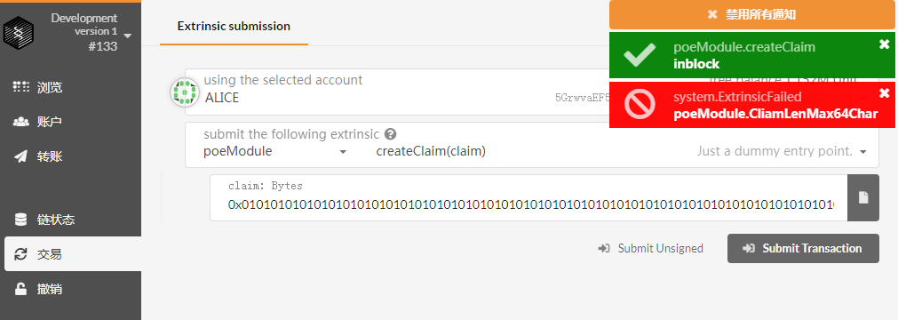
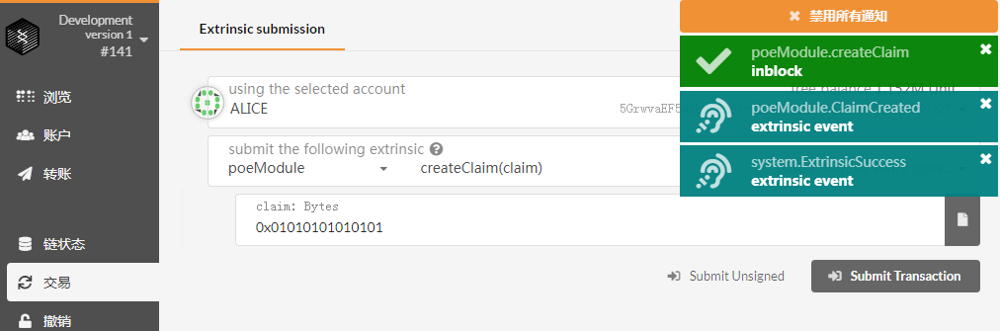
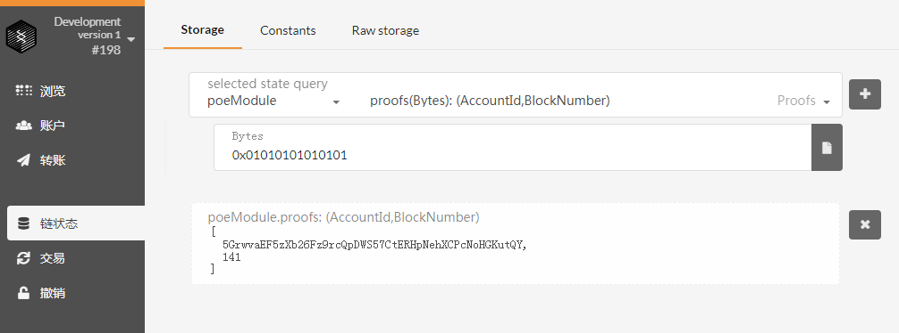
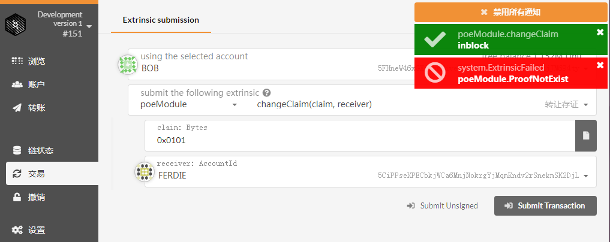
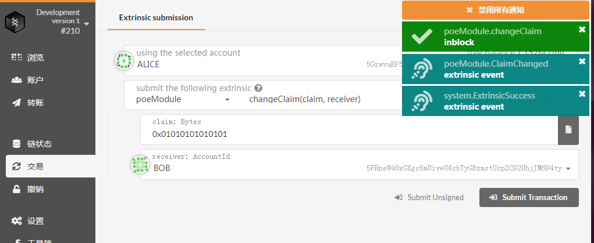
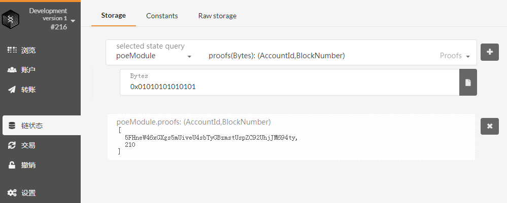
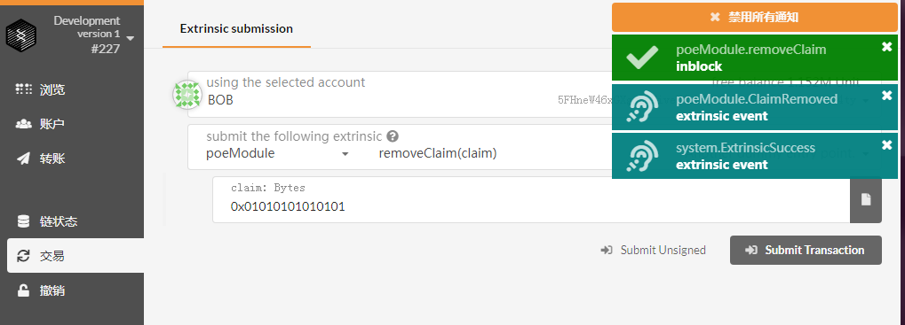
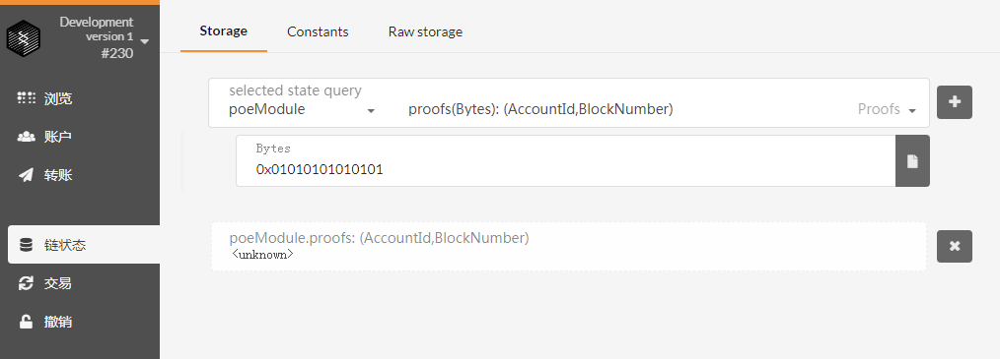
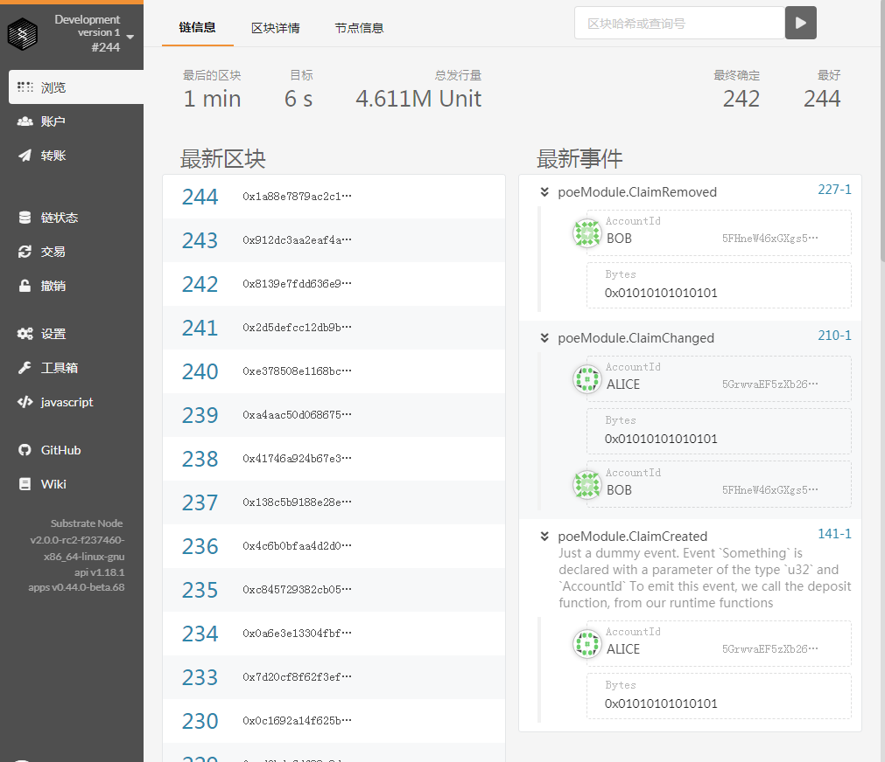

## 第二课作业 PoE 1

**1、 创建存证，claim长度小于4，错误提示“CliamLenMin4Char”**

**2、 创建存证，claim长度大于64，错误提示“CliamLenMax64Char”**

**3、 创建存证，成功**

**4、 查询存证 ，显示Accountid 为 Alice地址 和block num:141**

**5、 转让存证，claim随便填写，错误提示“ProofNotExist”**

**6、 转让存证，成功，存证新的所有人是 BOB**

**7、 查询存证 ，显示Accountid 为 BOB地址 和block num:210**

**8、删除存证，成功**

**9、 查询存证 ，显示为 unknow **

**10、 最新事件过程，创建存证→转让存证→删除存证**

