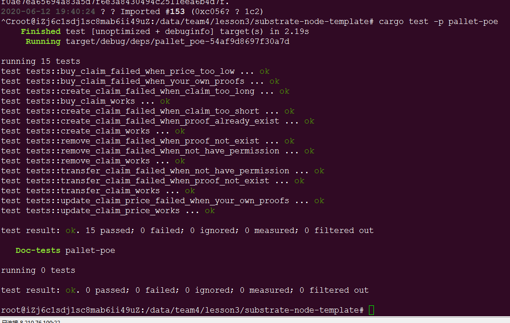
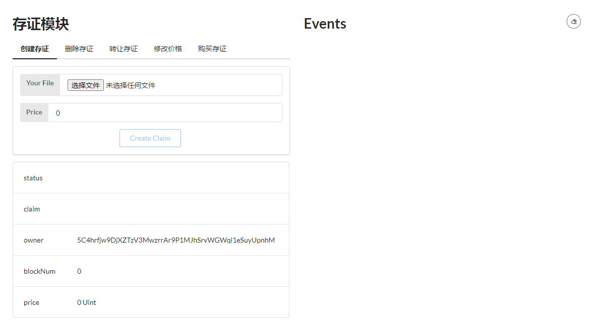
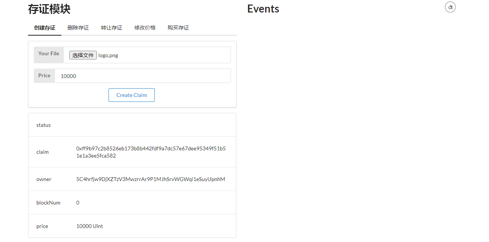
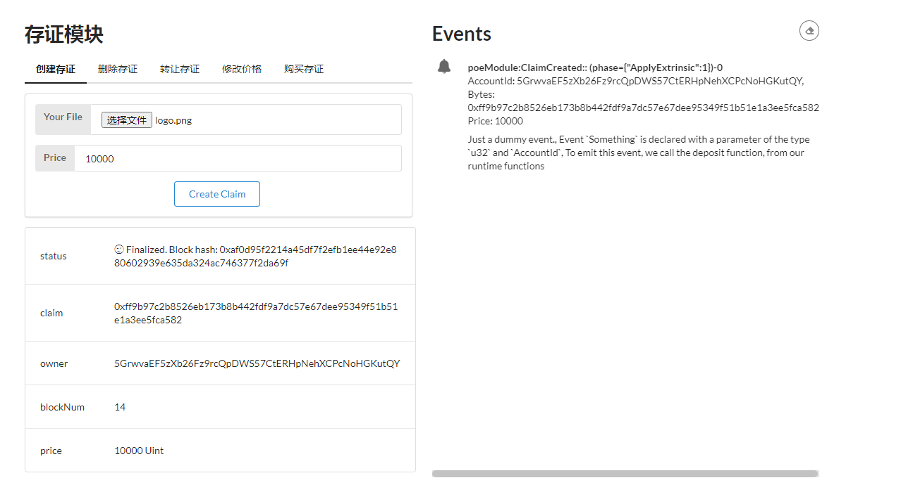
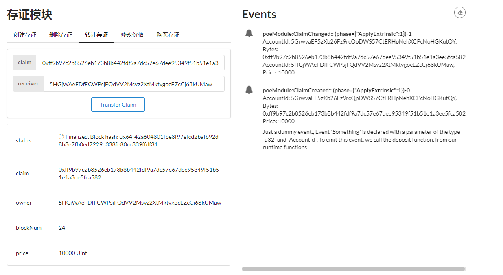
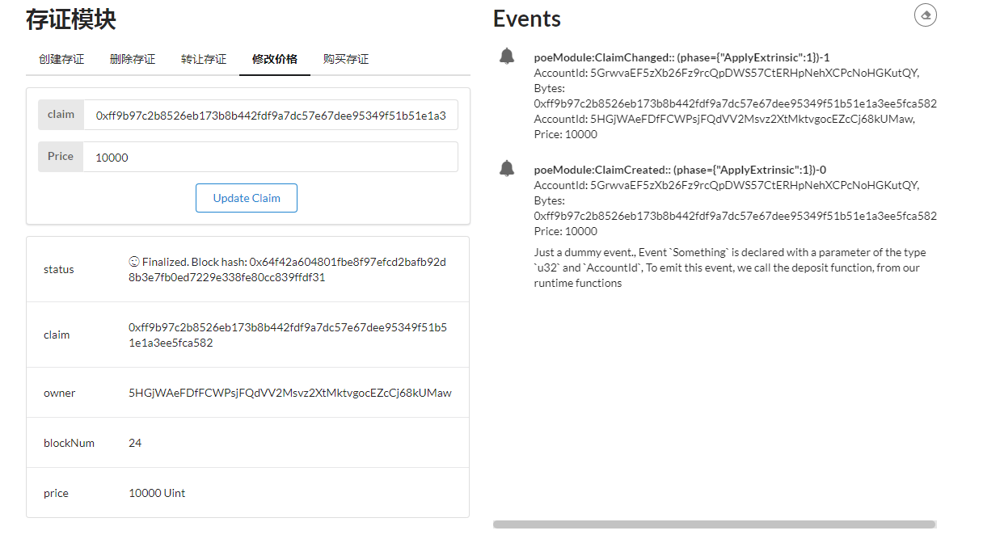
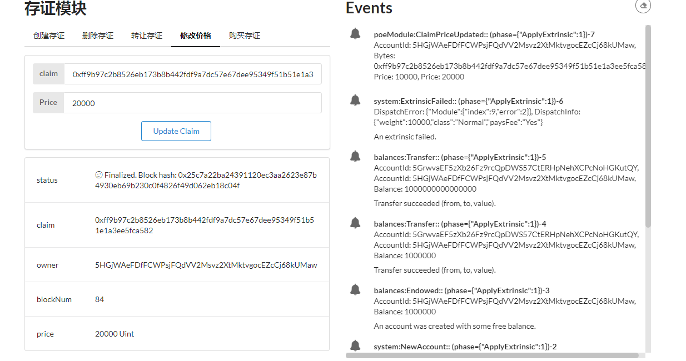
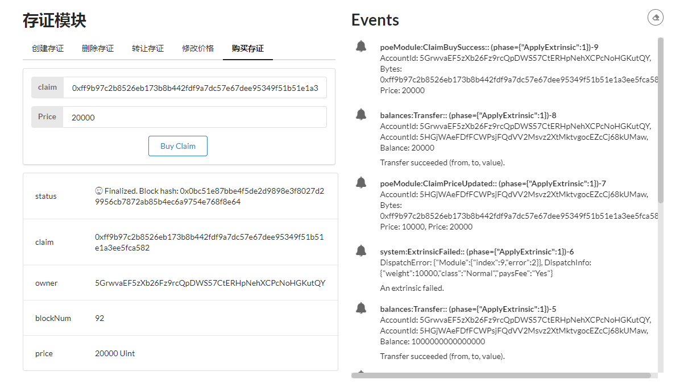
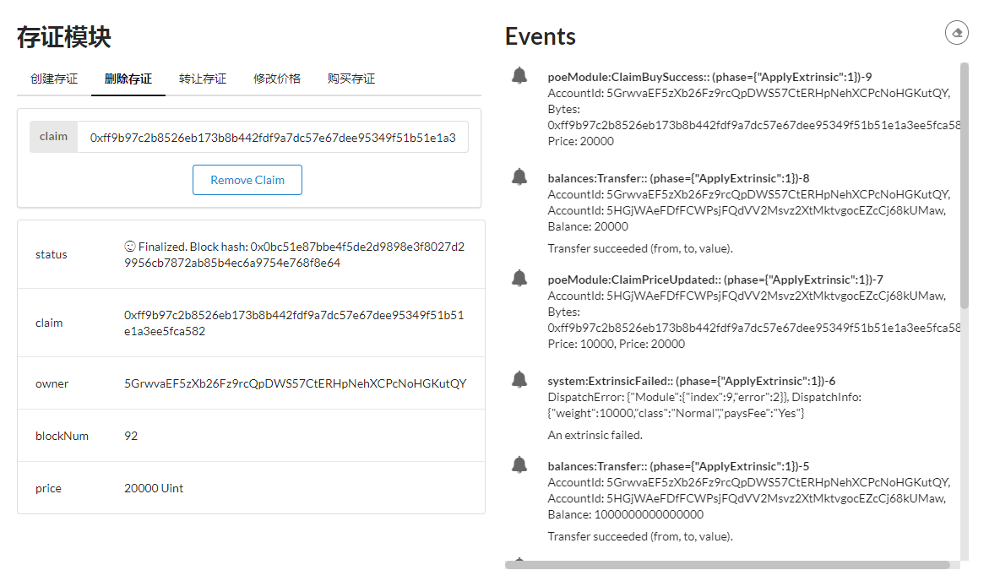
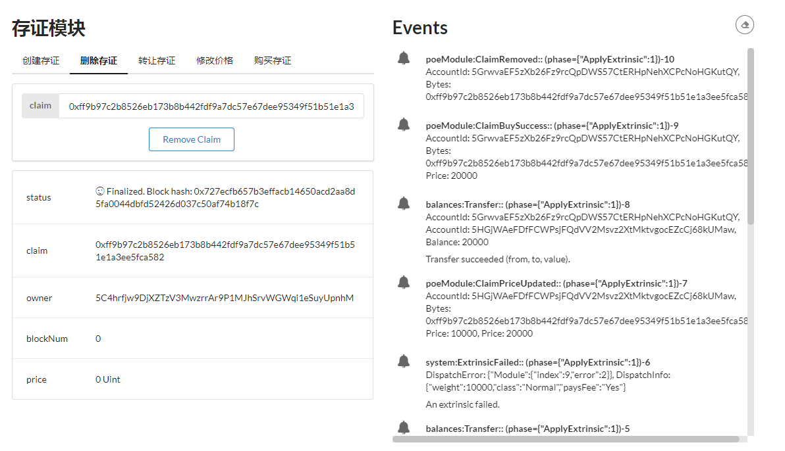

## 第三课作业  PoE 2

课程里会给出参考资料，大家一定要自己敲一遍**代码**！

注：

1. 提交源代码，运行`cargo test`的测试结果截图，前端UI的截图；
2. 测试应覆盖所有的业务逻辑，如不同的错误场景，以及一切正常的情况下，检查存储的数据是不是预期的那样。
3. 附加题不是必答的，但可以酌情加分。
4. 代码修改在本目录 substrate-node-template 和 substrate-front-end-template 的程序文件里。

第一题：编写存证模块的单元测试代码，包括：

* 创建存证的测试用例；  
https://github.com/ylic/team4/blob/lesson-3/lesson3/substrate-node-template/pallets/poe/src/tests.rs#L10-L57  

* 撤销存证的测试用例；  
https://github.com/ylic/team4/blob/lesson-3/lesson3/substrate-node-template/pallets/poe/src/tests.rs#L60-L102  

* 转移存证的测试用例；  
https://github.com/ylic/team4/blob/lesson-3/lesson3/substrate-node-template/pallets/poe/src/tests.rs#L106-L45

* 修改存证价格的测试用例；  
https://github.com/ylic/team4/blob/lesson-3/lesson3/substrate-node-template/pallets/poe/src/tests.rs#L148-L78

* 购买存证价格的测试用例；  
https://github.com/ylic/team4/blob/lesson-3/lesson3/substrate-node-template/pallets/poe/src/tests.rs#L182-L232

第二题：编写存证模块的UI，包括

* 创建存证的UI

* 转让存证的UI

* 修改存证价格的UI

* 购买存证的UI

* 删除存证的UI

第三题（附加题）：实现购买存证的功能代码：

* 用户A为自己的某个存证记录设置价格；
* 用户B可以以一定的价格购买某个存证，当出价高于用户A设置的价格时，则以用户A设定的价格将费用从用户B转移到用户A，再将该存证进行转移。如果出价低于用户A的价格时，则不进行转移，返回错误。

解题：  
1.存证记录增加price字段，记录存证的价格。    
2.创建存证时可以设置存证的初始价格。   
3.任何时间，都可以通过 update_claim_price 方法修改自己所属存证的价格。      
4.购买存证成功时，将存证的价格设置为购买的价格。之后可以由新的所有人修改价格。      